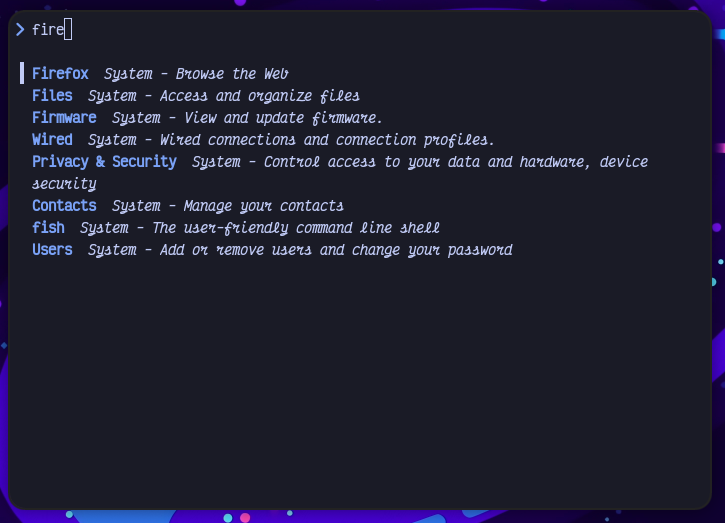

# vaxis-launcher

vaxis-launcher is a TUI launcher based on [pop-launcher](https://github.com/pop-os/launcher)

## Usage

First, you must have `pop-launcher` installed.

Second, use your favorite terminal to run `vaxis-launcher`. Personally, I have a
keybind to launch a terminal running this command. I use a rule within Sway to
launch a floating terminal running `vaxis-launcher`. Maybe you should too?

## Configuration

None. If you aren't using sway, you will want to change the launch command which
is currently hard-coded as `swaymsg exec <cmd>`

## Contributing

Contributions are welcome.

## Roadmap

- Icons via kitty graphics protocol
- Tab completion
- Real configuration
